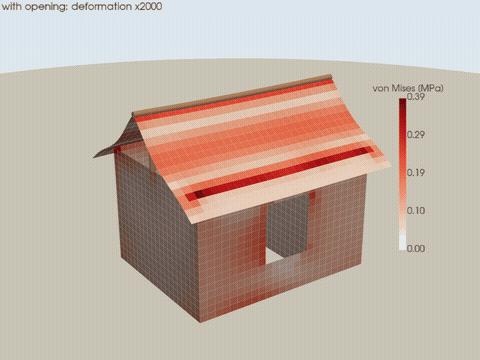
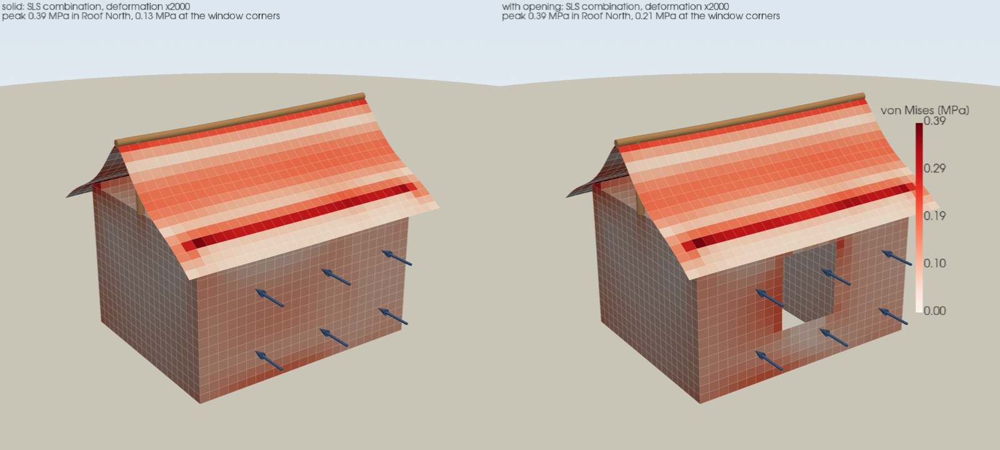

# IFC and FEM demo

A teaching demo that connects **BIM modelling in IFC** with a **structural check** and
**3D visualisation**, all in Python. It builds a small house as an IFC4 model, cuts a
window into one wall, turns both versions into a shell-and-frame finite element model,
and renders the geometry and the results on the real building.

The point of the demo is the data flow: the IFC file is the single source of truth, the
structural model is derived from it rather than redrawn, and the results are shown on the
actual geometry, not a schematic.





## Tools

| Package | Role |
|---|---|
| `ifcopenshell` | create, edit, validate and read back the IFC model |
| `PyNiteFEA` | 3D finite element analysis: quad shells for walls/roof, frame members for beam/posts |
| `pyvista` | VTK rendering: turntable videos and stress fields on the deformed structure |
| `imageio[ffmpeg]` | encode rendered frames into MP4 |

## Run it

```bash
uv sync
uv run python main.py      # ~15 seconds, writes to model/ and output/
uv run pytest
```

## Key limitations

- **Linear elastic, qualitative only.** The sharp re-entrant corners at the window opening
  are stress singularities in this model, so corner values depend on mesh density — this is
  a demo, not a design check.
- **Simplified idealisation.** Walls and roof become mid-surface shells, beams become axes;
  the window pane itself isn't modelled (only its share of wind load is passed to the
  opening edges).
- **Static loading only.** Self-weight, snow and wind are combined 1:1:1 with no dynamic,
  seismic, or code-specific load combinations.
