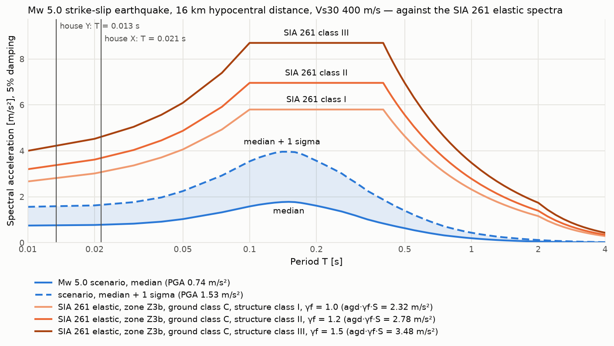
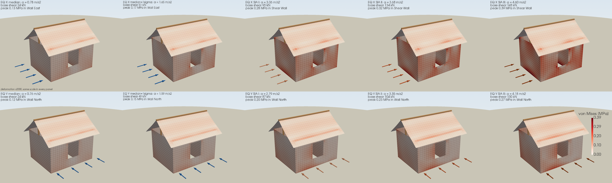

# ifc-fem-demo

A teaching demo that connects **BIM modelling in IFC** with a **structural check**,
**3D visualisation** and a **seismic scenario**, all in Python. It builds a small house as
an IFC4 model, cuts a window into one wall, turns both versions into a shell-and-frame
finite element model, renders the geometry and the results on the real building, and
finally asks what a specific earthquake near Sierre would do to it compared with what
SIA 261 designs for, as a spectrum and as stress in the model.

The point of the demo is the data flow: the IFC file is the single source of truth, the
structural model is derived from it rather than redrawn, and the results are shown on the
actual geometry, not a schematic.




## Tools

| Package | Role |
|---|---|
| `ifcopenshell` | create, edit, validate and read back the IFC model |
| `PyNiteFEA` | 3D finite element analysis: quad shells for walls/roof, frame members for beam/posts |
| `pyvista` | VTK rendering: turntable videos and stress fields on the deformed structure |
| `imageio[ffmpeg]` | encode rendered frames into MP4 |
| `matplotlib` | the response spectrum figure |

## Run it

```bash
uv sync
uv run python main.py      # about a minute, writes to model/ and output/
uv run pytest
```

## Seismic scenario (Stage 4)

The scenario is defined by parameters only, so it can be reproduced and varied
without touching code. Defaults describe a **Mw 5.0 strike-slip earthquake** with its
epicentre at 46.35 N / 7.40 E north of Sierre, 10 km deep, felt at a site in Sierre town
on ground with Vs30 = 400 m/s. All of them are dataclass fields in `seismic.py`
(`Earthquake`, `Site`, `DesignCode`) and command line flags of the stand-alone runner:

```bash
uv run python -m ifc_fem_demo.seismic                       # the default scenario
uv run python -m ifc_fem_demo.seismic --magnitude 5.5 --depth-km 6 --rake-deg -90 \
    --site-vs30 250 --site-ground-class D --structure-class II
```

Stage 4 computes and prints three things:

1. **Scenario spectrum.** The 5%-damped pseudo-spectral acceleration at 62 periods from
   0.01 s to 4 s plus PGA, as the median and the median + 1 sigma, from the
   Akkar, Sandikkaya & Bommer (2014) ground-motion model in its hypocentral-distance
   form (Mw 4-8, up to 200 km, Vs30-dependent non-linear site term). The epicentral
   distance is the great-circle distance to the site; the hypocentral distance adds the
   depth. The coefficients are the ones transcribed in OpenQuake's hazardlib, and the
   tests check the implementation against the verification values generated with the
   authors' own code.
2. **SIA 261 elastic spectra** for the seismic zone (Z3b, agd = 1.6 m/s2, by default) and
   the ground class A-E (S, TB, TC, TD from Table 24), one per structure class I, II and
   III (importance factor 1.0, 1.2 and 1.5). All three are plotted and tabulated; the
   configured structure class is the one used for the code/median ratio. Edition 2020;
   the 2014 edition differs only in the class III factor (1.4).
3. **What it means for this house.** A modal analysis of the PyNite model (dead load
   lumped as mass) gives the natural periods and the effective modal mass along X and
   Y. Both spectra are read at the dominant period in each direction and turned into a
   rigid-box base shear estimate, SA times the seismic mass.

The point of the comparison: a moderate earthquake nearby produces a spectrum well below
the code envelope, which represents a 475-year hazard rather than any single event, and
a squat concrete box with periods around 0.02 s sees essentially the PGA of either.

## Equivalent static lateral load (Stage 5)

The spectral accelerations then go back into the PyNite model as ten load combinations:
each horizontal axis at the scenario median, the median + 1 sigma, and the SIA 261
acceleration of each structure class I, II and III. Each
combination is the dead weight plus the dead mass accelerated along one axis, lumped on
the nodes that are free to move. The house is far stiffer than any spectrum's corner
period, so every kilogram sees the same acceleration and the support reactions add up to
SA times the seismic mass. The model is solved once for all ten.

The stage prints the base shear, lateral displacement and von Mises stress per case and
writes a 5 x 2 grid of the deformed, stressed house with one colour scale, plus a
turntable of the governing case (SIA 261 class III along X). The load arrows take the
colour of their spectrum in the spectra figure: blue for the scenario, orange from light
to dark for structure classes I to III.



Running `uv run python -m ifc_fem_demo.seismic` does the same for any scenario given on
the command line.

## Key limitations

- **Linear elastic, qualitative only.** The sharp re-entrant corners at the window opening
  are stress singularities in this model, so corner values depend on mesh density — this is
  a demo, not a design check.
- **Simplified idealisation.** Walls and roof become mid-surface shells, beams become axes;
  the window pane itself isn't modelled (only its share of wind load is passed to the
  opening edges).
- **Static loading only.** Self-weight, snow and wind are combined 1:1:1 for serviceability.
  The earthquake is an equivalent static force with the elastic spectrum (no behaviour
  factor, no accidental torsion, one direction at a time, no combination of X and Y) and is
  not combined with snow or wind; SIA 260's seismic design situation is not reproduced.
- **One ground-motion model, one point source.** Scenario spectra come from a single
  empirical model with a spherical-Earth distance and no finite fault, directivity or
  basin effects; the Rhone valley in particular is known for strong site amplification
  that a Vs30 term cannot capture. Median + 1 sigma is one standard deviation of the
  model's total scatter, not a confidence bound on the scenario.
- **The code spectrum is not a scenario.** SIA 261's agd is a 475-year uniform hazard
  value; the comparison shows how a specific event relates to the design envelope, not
  whether the house complies.
